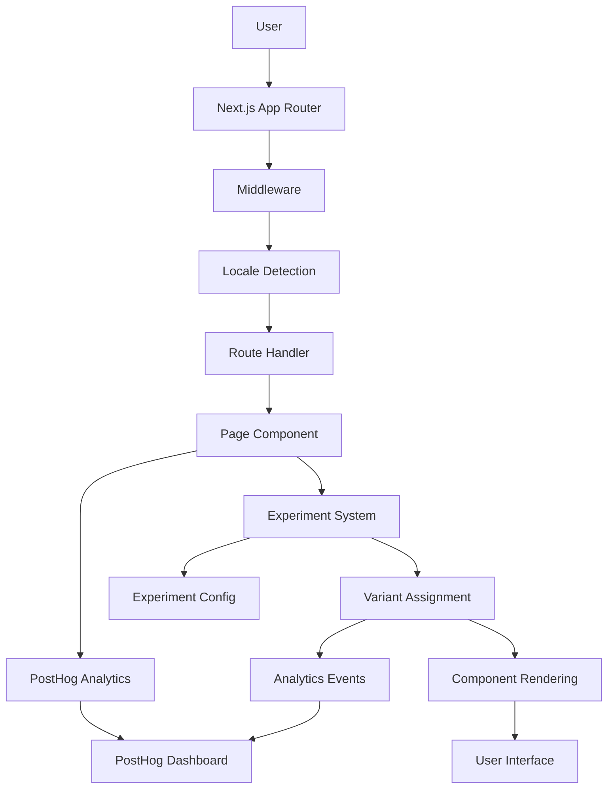
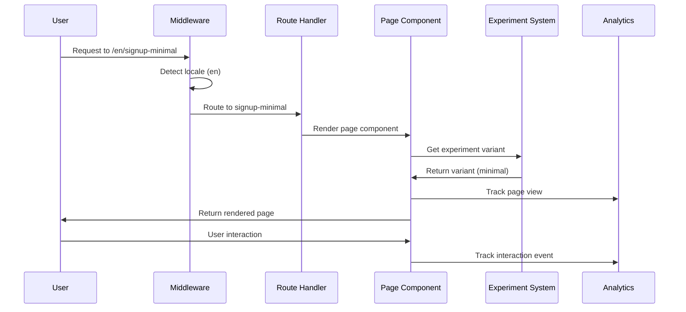
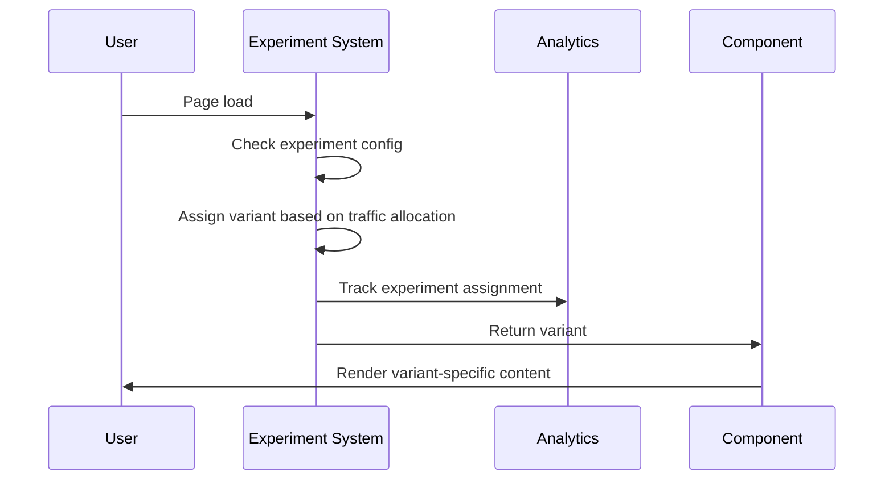
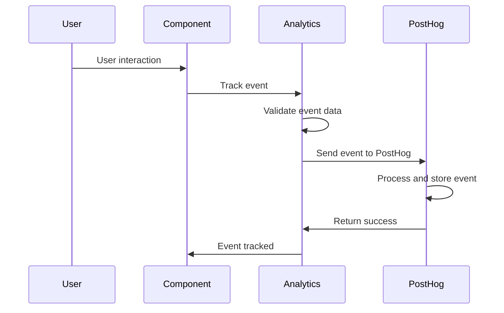
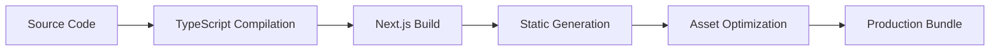
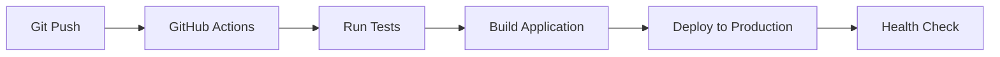

# Architecture

The Wow AI Showcase is built with a modern, scalable architecture that supports A/B testing, analytics, and internationalization. This document provides a comprehensive overview of the system architecture.

## 🏗️ High-Level Architecture



## 📁 Project Structure

```
wowshowcase/
├── .vitepress/                 # VitePress documentation
├── docs/                      # Legacy documentation
├── public/                    # Static assets
├── src/
│   ├── app/                   # Next.js App Router
│   │   ├── [locale]/          # Internationalized routes
│   │   │   ├── (landing-variants)/  # Landing page variants
│   │   │   │   ├── signup-minimal/
│   │   │   │   ├── signup-social-proof/
│   │   │   │   └── signup-router/
│   │   │   ├── brand/         # Brand assets
│   │   │   └── onboarding/    # User onboarding
│   │   ├── globals.css        # Global styles
│   │   └── layout.tsx         # Root layout
│   ├── components/            # Reusable components
│   │   ├── ui/               # UI components
│   │   └── PostHogProvider.tsx
│   ├── experiments/           # Experiment system
│   │   ├── config.ts         # Experiment definitions
│   │   ├── hooks/            # Experiment hooks
│   │   └── tracking.ts       # Analytics tracking
│   ├── i18n/                 # Internationalization
│   │   └── config.ts         # i18n configuration
│   └── lib/                  # Utilities and configurations
│       └── posthog.ts        # PostHog configuration
├── messages/                 # Translation files
│   ├── en.json              # English translations
│   └── ar.json              # Arabic translations
└── package.json
```

## 🚀 Technology Stack

### Frontend Framework
- **Next.js 14** - React framework with App Router
- **React 18** - UI library with latest features
- **TypeScript** - Type-safe development
- **Tailwind CSS** - Utility-first styling

### Analytics & Tracking
- **PostHog** - Analytics and experiment tracking
- **Custom Events** - Business-specific metrics
- **Real-time Dashboards** - Live monitoring

### Internationalization
- **next-intl** - Internationalization framework
- **RTL Support** - Right-to-left language support
- **Locale Detection** - Automatic language detection

### Development Tools
- **ESLint** - Code quality and consistency
- **Prettier** - Code formatting
- **Husky** - Git hooks for quality
- **VitePress** - Documentation framework

## 🎯 Core Systems

### 1. Next.js App Router

The application uses Next.js 14's App Router for:

- **File-based Routing** - Automatic route generation
- **Server Components** - Server-side rendering
- **Client Components** - Interactive UI elements
- **Middleware** - Request processing and locale detection

```typescript
// src/app/[locale]/layout.tsx
export default async function LocaleLayout({ 
  children, 
  params 
}: { 
  children: React.ReactNode
  params: { locale: string }
}) {
  const { locale } = params
  const messages = await getMessages({ locale })
  
  return (
    <html lang={locale} dir={locale === "ar" ? "rtl" : "ltr"}>
      <body>
        <PostHogProvider>
          <NextIntlClientProvider messages={messages} locale={locale}>
            {children}
          </NextIntlClientProvider>
        </PostHogProvider>
      </body>
    </html>
  )
}
```

### 2. Experiment System

The experiment system provides:

- **Route-based Experiments** - Different pages for different variants
- **Component-based Experiments** - A/B testing within components
- **Variant Assignment** - Automatic user assignment
- **Analytics Integration** - Automatic tracking

```typescript
// src/experiments/config.ts
export interface Experiment {
  variants: string[]
  defaultVariant: string
  trafficAllocation: number
  startDate?: Date
  endDate?: Date
}

export const experiments: Record<string, Experiment> = {
  'signup-variant': {
    variants: ['minimal', 'social-proof', 'router'],
    defaultVariant: 'minimal',
    trafficAllocation: 0.1,
  }
}
```

### 3. Analytics System

PostHog integration provides:

- **Event Tracking** - User interactions and conversions
- **Experiment Analytics** - A/B test results
- **Real-time Monitoring** - Live performance data
- **Custom Dashboards** - Business-specific metrics

```typescript
// src/lib/posthog.ts
import { PostHog } from 'posthog-js'

export const initPostHog = () => {
  if (typeof window !== 'undefined') {
    const posthog = new PostHog(process.env.NEXT_PUBLIC_POSTHOG_KEY!, {
      api_host: process.env.NEXT_PUBLIC_POSTHOG_HOST,
    })
    posthog.init()
  }
}
```

### 4. Internationalization System

The i18n system supports:

- **Multi-language Support** - English and Arabic
- **RTL Support** - Right-to-left language rendering
- **Locale Detection** - Automatic language detection
- **Translation Management** - Centralized translation files

```typescript
// src/i18n/config.ts
export const locales = ['en', 'ar'] as const
export type Locale = typeof locales[number]

export const defaultLocale: Locale = 'en'

export const localeNames: Record<Locale, string> = {
  en: 'English',
  ar: 'العربية'
}
```

## 🔄 Data Flow

### 1. User Request Flow



### 2. Experiment Assignment Flow



### 3. Analytics Event Flow



## 🎨 Component Architecture

### 1. Component Hierarchy

```
App
├── RootLayout
│   ├── PostHogProvider
│   └── NextIntlClientProvider
│       └── LocaleLayout
│           ├── Header
│           ├── Main
│           │   └── PageComponent
│           │       ├── Hero
│           │       ├── Features
│           │       ├── SignupForm
│           │       └── Footer
│           └── LanguageSwitcher
```

### 2. Component Types

- **Layout Components** - Page structure and navigation
- **UI Components** - Reusable interface elements
- **Page Components** - Route-specific content
- **Provider Components** - Context and state management

### 3. Component Communication

- **Props** - Parent to child communication
- **Context** - Global state management
- **Hooks** - Stateful logic and side effects
- **Events** - User interaction handling

## 🔧 Configuration Management

### 1. Environment Variables

```env
# PostHog Configuration
NEXT_PUBLIC_POSTHOG_KEY=your_posthog_project_key
NEXT_PUBLIC_POSTHOG_HOST=https://app.posthog.com

# Experiment Configuration
NEXT_PUBLIC_EXPERIMENT_TRAFFIC_ALLOCATION=0.1
NEXT_PUBLIC_EXPERIMENT_DEFAULT_VARIANT=minimal

# Optional: Clerk Authentication
NEXT_PUBLIC_CLERK_PUBLISHABLE_KEY=your_clerk_key
CLERK_SECRET_KEY=your_clerk_secret
```

### 2. Experiment Configuration

```typescript
// src/experiments/config.ts
export const experiments: Record<string, Experiment> = {
  'signup-variant': {
    variants: ['minimal', 'social-proof', 'router'],
    defaultVariant: 'minimal',
    trafficAllocation: 0.1,
    startDate: new Date('2024-01-01'),
    endDate: new Date('2024-12-31'),
  }
}
```

### 3. Translation Configuration

```typescript
// src/i18n/config.ts
export const locales = ['en', 'ar'] as const
export const defaultLocale: Locale = 'en'

export const localeNames: Record<Locale, string> = {
  en: 'English',
  ar: 'العربية'
}
```

## 🚀 Performance Optimization

### 1. Static Generation

- **Pre-rendered Pages** - Static HTML generation
- **Incremental Static Regeneration** - On-demand updates
- **Image Optimization** - Next.js Image component
- **Code Splitting** - Automatic code splitting

### 2. Caching Strategy

- **Browser Caching** - Static asset caching
- **CDN Caching** - Global content delivery
- **API Caching** - Response caching
- **Component Caching** - React component memoization

### 3. Bundle Optimization

- **Tree Shaking** - Remove unused code
- **Minification** - Code compression
- **Gzip Compression** - Response compression
- **Bundle Analysis** - Size monitoring

## 🔒 Security Architecture

### 1. Data Protection

- **HTTPS** - Encrypted data transmission
- **Secure Headers** - Security headers
- **Input Validation** - Form validation
- **XSS Protection** - Cross-site scripting prevention

### 2. Privacy Compliance

- **GDPR Compliance** - European data protection
- **CCPA Compliance** - California privacy rights
- **Data Retention** - Automatic data cleanup
- **User Consent** - Privacy consent management

## 📊 Monitoring & Observability

### 1. Application Monitoring

- **Error Tracking** - JavaScript error monitoring
- **Performance Monitoring** - Core Web Vitals
- **User Analytics** - Behavior tracking
- **Business Metrics** - Conversion tracking

### 2. Infrastructure Monitoring

- **Server Health** - System resource monitoring
- **Database Performance** - Query performance
- **CDN Performance** - Content delivery monitoring
- **Uptime Monitoring** - Service availability

## 🚀 Deployment Architecture

### 1. Build Process



### 2. Deployment Pipeline



## 📚 Documentation Architecture

### 1. VitePress Documentation

- **Getting Started** - Setup and configuration
- **API Reference** - Component and utility documentation
- **Guides** - Step-by-step tutorials
- **Examples** - Working code samples

### 2. Code Documentation

- **TypeScript Types** - Type definitions
- **JSDoc Comments** - Function documentation
- **README Files** - Project documentation
- **Inline Comments** - Code explanations

---

**Ready to dive deeper?** Check out our [Getting Started Guide](/getting-started) or explore the [Experiments System](/experiments/)!
